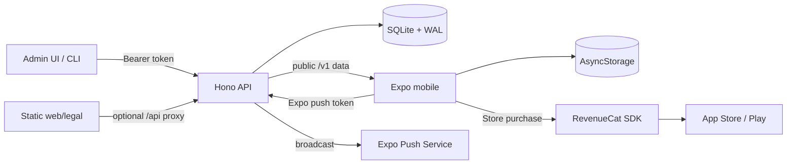

# Architecture and decision rules

## What the source actually ships

`package.json` declares npm workspaces for `apps/*` and `services/*`. The runtime surfaces are:

| Surface | Source path | Technology | Responsibility |
| --- | --- | --- | --- |
| Mobile | `apps/mobile` | Expo SDK 57, React Native, TypeScript, Expo Router | Navigation, branded experience, offline reads, local preferences, RevenueCat purchases, notifications |
| API | `services/api` | Node 22, Hono, Zod, better-sqlite3 | Public content/config, admin mutations, push token registry/broadcast |
| Landing/legal | `apps/web` | Static HTML/CSS served by nginx | Marketing, privacy, terms, support |
| Admin | `apps/admin` | Static HTML/CSS/JS served by nginx | Content CRUD/import, push, version floor |
| Hosting | root `docker-compose.yml`, `deploy/` | Docker Compose, nginx, Coolify | API + web + admin, persistent SQLite volume |

No user accounts, product analytics, payment backend, or shared typed package exist. The API sends public content; RevenueCat and the app stores own purchase status. Mobile app content is cached in AsyncStorage. The backend stores server content in SQLite WAL mode. The app also stores saved cards, pack order, theme selection, and free-preview counters on device.

## Data flow and ownership

The key split: the API decides what content exists; the device decides presentation and non-sensitive preferences; RevenueCat `CustomerInfo` decides paid entitlement. The local free counter is a UX gate, not a security boundary. Public API responses contain the content, so a paid product with confidential server data needs authenticated endpoints and server entitlement verification.

## Select the stack

This shape fits a solo/small-team content app with modest write volume, a few administrator users, mostly reads, optional offline access, and app-store purchases. Omit API/admin if content is static and bundled. Omit RevenueCat if monetization is absent. Use accounts and a managed database if users share state or need reliable cross-device sync. Use server-side purchase verification when the API must refuse unpaid requests. Choose a job queue or managed notification service for large-scale, personalized, or scheduled messaging; the source API sends simple global pushes.

Do not copy package versions as canonical. Pin compatible versions after checking the target Expo SDK and official versioned docs. Native modules require a development build and may change OTA compatibility.

## Build order

1. Complete `templates/app-brief.md` and `templates/decisions.md`; define one user journey, data ownership, and failure states.
2. Establish workspace, environment contract, app IDs/domains, design tokens, API contracts, and legal/support URLs.
3. Build and verify one vertical slice: persisted API entity → public endpoint → mobile fetch/cache → screen → admin edit.
4. Add purchases only after the free and paid boundary is explicit. Test entitlement transitions with real store sandbox purchases.
5. Add optional push/OTA, deployment, backups, and release gates according to actual requirements.

## Source-specific choices to reconsider

- `apps/mobile/lib/api.ts` casts JSON to TypeScript interfaces without runtime validation. Add runtime response validation where schema drift would hurt, especially offline cache hydration.
- The API and mobile define related types separately. For a larger project, generate a typed client or share contracts without coupling native and server runtime packages.
- `apps/admin/admin.js` is a static console with bearer token in session storage. Use stronger admin identity/session controls for multi-user or high-risk operations.
- The API has open CORS. Scope browser origins when an authenticated browser client is involved. CORS is not a substitute for authentication.
- Repository docs contain stale setup and plan details. Treat implementation and current deployment config as source of truth; keep new docs tied to release verification.
